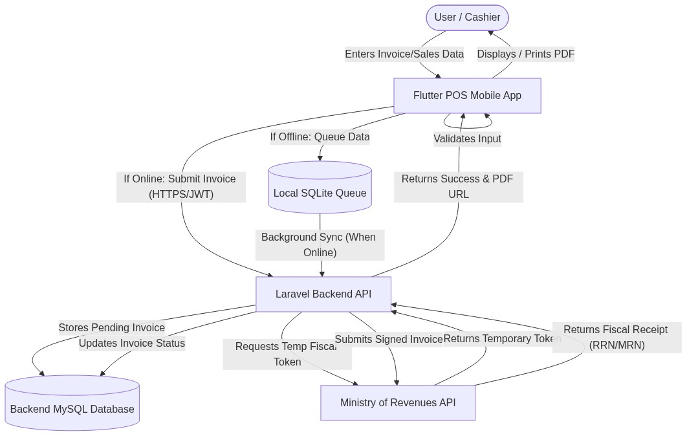
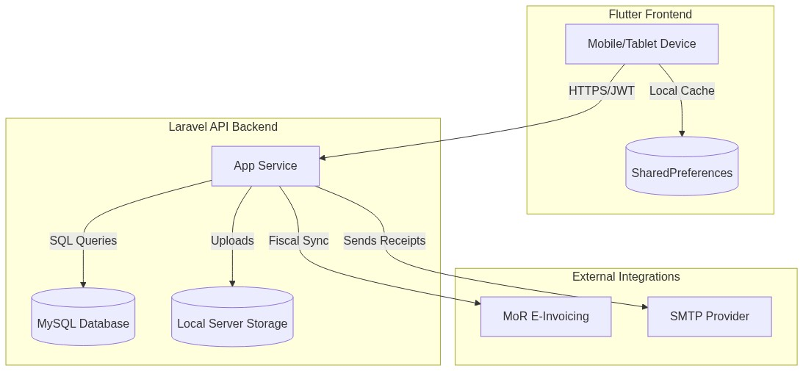
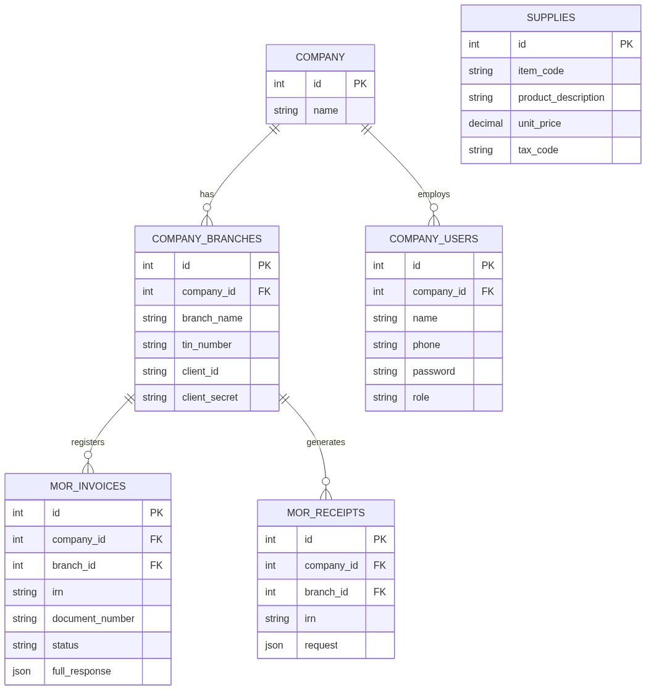

# Mobile Application Security Testing Requirements Document
**Prepared By**: Information Network Security Administration (INSA) 2025
**Submitted by**: Micro Sun and Solutions PLC (MSS)
**Submitted to**: Information Network Security Administration (INSA)

---

## Table of Contents
1. Introduction
    1. Purpose
    2. Ownership
    3. Scope
    4. Objective of this certificate requested
2. Legal and Administrative Documents
3. Technical Documentation for Web Application Security Testing
    1. Business Architecture and Design
    2. Features of the Web Application
    3. Security Functionality Document
    4. Secure Coding Standard Documentation
    5. Threat Modeling & Risk Management
    6. Previous Security Testing Reports
    7. OS Supported by the Mobile Application
    8. Hybrid Framework Specifics
    9. Logging & Monitoring Setup
    10. Specific Functionalities for Detailed Testing
    11. Restrictions or Limitations on Testing Approach
    12. Compliance or Regulatory Requirements
    13. Known Vulnerabilities or Security Concerns
4. API Security Audit Requirements
    1. API Types
    2. Authentication Mechanism
    3. Third-Party Integrations
    4. Authorization and Access Control
    5. Full API Documentation
5. Contact Information and Communication Channel
6. Specific Scope Table
7. Threat Model Mapping
8. System Functionality
9. Conclusion

---

## Background of Organization

Micro Sun and Solutions PLC (MSS) is an IT company founded in January 1997, specializing in hardware and network solutions. We offer customized solutions tailored to various industries, including government, banking, and telecom. We focus on high-quality software development and implementation, providing comprehensive corporate solutions across multiple sectors. Our company emphasizes 100% customer satisfaction and aims to deliver quality products and services at an affordable cost.

---

## 1. Introduction

### 1.1 Purpose
This document provides an overview of the Web and Mobile Application Security Testing Requirements Document, compiled for the Information Network Security Administration (INSA). The application in scope is the **Deresegn Point of Sale (POS) and SaaS Application**, which integrates with the Ethiopian Ministry of Revenues (MoR) e-invoicing system.

### 1.2 Ownership
The owner of this document is the **Deresegn Engineering and Compliance Department**. 

### 1.3 Scope
The scope encompasses the security mechanisms, architectural layouts, and data flows of the Deresegn POS/SaaS application:
- The Flutter-based mobile client interfaces.
- The Laravel 8 (PHP) backend REST API.
- The local SharedPreferences storage handling offline queuing.
- The integration with the Ministry of Revenues (MoR) e-invoicing API.

### 1.4 Objective of this certificate requested
The objective of requesting this security certificate is to comply with the national cybersecurity mandates established by the Information Network Security Administration (INSA). Obtaining this certification ensures that the Deresegn Point of Sale (POS) and SaaS Application meets the rigorous security, integrity, and confidentiality standards required before public rollout and handling sensitive MoR fiscal data.

---

## 2. Legal and Administrative Documents (Mandatory)

The following legal prerequisites and administrative documents are mandatory prior to the finalization of the INSA audit:
1. **Updated Trade License**: [Placeholder for Trade License ID]
2. **TIN Number or National ID**: [Placeholder for TIN Number]
3. **System/Product Patent Certificate (if available)**: [Placeholder for Patent]

---

## 3. Technical Documentation for Web Application Security Testing

### 3.1 Business Architecture and Design

#### 3.1.1 Data Flow Diagram (DFD)

1. **Invoice Initialization**: The cashier (User) selects items and initiates an invoice on the Flutter POS Application.
2. **Local Validation**: The mobile app validates inventory and necessary fields locally.
3. **Network Check & Queuing**: 
   - Offline: The transaction is queued securely in local SharedPreferences.
   - Online: The request is transmitted via HTTPS to the Laravel backend.
4. **Backend Processing & Authentication**: The Laravel API authenticates the user via a JWT token. It checks the specific Branch TIN and fetches the Branch Password to request a temporary MoR token.
5. **Fiscal Registration**: The backend submits the payload to the MoR API. The MoR returns a fiscal receipt number.
6. **Finalization**: The backend updates the database and returns a success response.

#### 3.1.2 System Architecture Diagram

- **Presentation Layer (Frontend)**: Flutter (Dart). Employs GetX for state management and routing, and SharedPreferences for offline queuing.
- **Application Layer (Backend)**: Built with the Laravel 8 framework.
- **Data Layer (Backend)**: Relational MySQL database. Storage for receipts is offloaded to the local server storage.
- **Integration Layer**: Connects securely with the Ministry of Revenues (MoR) API.

#### 3.1.3 Entity Relationship Diagram (ERD)

**Key Entities and Definitions**:
- **COMPANY & COMPANY_USERS**: `COMPANY` represents the master tenant. `COMPANY_USERS` contains `name`, `phone`, `password`, and `role`. 
- **COMPANY_BRANCHES**: Represent the physical stores tied to a company. They contain the critical `tin_number`, `client_id`, and `client_secret` (encrypted via model casts).
- **MOR_INVOICES**: The central fiscal transactional record. Holds `irn`, `document_number`, `status`, and the `full_response` (JSON). Tied to both a Branch and a Company.
- **MOR_RECEIPTS**: Represents actual payments synced with the MoR. 
- **SUPPLIES**: Represents inventory items, holding `item_code`, `unit_price`, and `tax_code`.

### 3.2 Features of the Web Application
- **Development Frameworks**: Flutter (SDK ^3.12.2) and Dart (>=3.0.0) for Frontend; Laravel 8 (PHP) for Backend.
- **Offline Reliability**: Invoices generated during internet outages are converted to JSON and queued locally in SharedPreferences.
- **Actor Types**: 
  - *Super Admin / Owner*: Global oversight, company registration.
  - *Branch Users*: Restricted to specific branch checkout functions.

### 3.3 Security Functionality Document

#### 3.3.1 Authentication and Access Control
1. **Access Allocation**: Users are assigned roles (e.g., owner) upon creation.
2. **API Authentication**: Executed via JSON Web Tokens (JWT). The payload is signed with an HS256 cryptographic secret.

#### 3.3.2 User ID Authentication
Authentication utilizes unique Phone Numbers and Passwords tied to specific Company IDs.

#### 3.3.3 Change Password
The application relies on users to set their password during registration or account creation. There is currently no mechanism that forces a user to change their password upon their first login. 

#### 3.3.4 User ID / Password Management
Each user registers with a unique Phone Number. The system relies on administrative procedures to discourage the sharing of accounts between cashiers.

#### 3.3.5 Sharing Information
Users are expected to keep their credentials confidential.

#### 3.3.6 Complexity of Password
The backend API enforces a minimum password length of six (6) characters during registration and login. Passwords are mathematically hashed exclusively using Laravel's native Bcrypt implementation (`Hash::make`). There are no programmatic requirements for special characters, numbers, or mixed casing.

#### 3.3.7 Password Expiry
The application does not currently enforce password expiration or rotation. Passwords remain valid indefinitely unless manually changed by the user or an administrator.

#### 3.3.8 Password History
Password history is not tracked in the database. Users are permitted to reuse old passwords if they choose to change them.

#### 3.3.9 Invalid Login Attempt
If a user submits an incorrect password, the API returns a standard `401 Unauthorized` response. The application currently relies on the hosting provider's infrastructure to handle mass brute-force attacks, as API-level rate limiting (`ThrottlesLogins`) is not explicitly implemented on the authentication endpoints.

#### 3.3.10 Lockout Duration
Because invalid login attempts are not systematically counted in the database, there is no automatic lockout duration enforced on user accounts.

#### 3.3.11 Session Idle Time
The JWT Time-To-Live (TTL) is configured to expire after 60 minutes. Once the 60 minutes elapse, the token is invalidated and the user must re-authenticate.

#### 3.3.12 Encryption & Secure Communication
- **Data in Transit**: The application relies on standard TLS encryption provided by the hosting environment for all API communications.
- **Data at Rest**: Passwords are never stored in plaintext (hashed using Bcrypt). Sensitive MoR credentials (`client_secret`, `api_key`) in the `company_branches` table are encrypted at rest using Laravel's model casting mechanism (`encrypted`).

### 3.4 Secure Coding Standard Documentation

#### 3.4.1 Secure Coding Requirements
- **Input Validation**: API endpoints utilize Laravel Validator logic (e.g., `Validator::make`) to ensure required fields and correct data types are passed.
- **Database Safety**: The Eloquent ORM is utilized to interact with the MySQL database, which utilizes PDO parameterization to mitigate SQL Injection (SQLi) vulnerabilities.
- **Secrets Management**: Database credentials and JWT secrets are injected via environment variables (`.env`).

### 3.5 Threat Modeling & Risk Management

#### 3.5.1 Asset Identification
1. **Critical (High Risk)**: MoR fiscal tokens, Branch TIN passwords, user password hashes.
2. **Important (Medium Risk)**: Invoice historical data.
3. **Public (Low Risk)**: Item catalogs.

#### 3.5.2 Risk Assessment and Management
- **Spoofing**: Mitigated by stateless JWT validation ensuring requests originate from authenticated users.
- **Information Disclosure**: Prevented by hiding sensitive data (like the `client_secret` and `api_key`) from API JSON responses using Laravel's `$hidden` array on Eloquent models.

### 3.6 Previous Security Testing Reports
The application relies on standard Laravel and Flutter linting alongside standard functional testing. Any comprehensive penetration testing is performed prior to major production releases locally.

### 3.7 OS Supported by the Mobile Application
The application supports the Android operating system. 
* **Minimum Supported OS:** Android 5.0 (Lollipop) - API Level 21 (Flutter default `minSdkVersion`).
* **Maximum Supported OS:** Android 14 - API Level 34 (Flutter default `targetSdkVersion`).
*(Note: iOS is currently out of scope for this specific audit, but the framework is cross-platform capable).*

### 3.8 Hybrid Framework Specifics
The Deresegn mobile application is a hybrid cross-platform application developed using the **Flutter framework (SDK ^3.12.2)** and Dart language. 
* **State Management & Routing:** Handled by the `get` plugin (GetX).
* **Network & API Communication:** Managed via the `dio` HTTP client.
* **Storage & Native Interaction:** Uses `flutter_secure_storage` for securely caching tokens, and `shared_preferences` for managing the local offline invoice queue. The application compiles directly to native ARM code, ensuring high performance without relying on web-views for core business logic.

### 3.9 Logging & Monitoring Setup
The application utilizes the `logger` package to track user activity, network state changes, and security events. 
* **Client-Side Logging:** Important application state changes (e.g., `Network restored, attempting to sync offline queue`, `Company authentication required`) and HTTP request failures (e.g., `Retrying GET path after X seconds`) are logged to the console for debugging. 
* **Production Alerting:** In production, standard HTTP 4xx and 5xx errors are captured by the backend server logs.

### 3.10 Specific Functionalities for Detailed Testing
We request that the INSA audit specifically focuses on the following security-critical workflows:
1. **Invoice Generation:** The core flow of generating, validating, and submitting fiscal invoices securely to the MoR.
2. **The Offline-to-Online Sync Mechanism:** Validating the security of invoices temporarily queued in `shared_preferences` during network outages.
3. **MoR Token Exchange:** The backend process of reading the Branch TIN and Password, requesting a temporary MoR token, and signing the fiscal receipt.
4. **Multi-Tenant Authentication:** The JWT-based login flows (`/api/company/login`, `/api/branch/login`) ensuring strict data isolation between companies and branches.

### 3.11 Restrictions or Limitations on Testing Approach
* **No Denial-of-Service (DoS) or DDoS:** Please refrain from conducting volumetric attacks against the production API (`https://api.deresegn.com`).
* **Safe Testing Environment:** All dynamic testing should be conducted using the provided Test Accounts. Testers must not tamper with or attempt to modify live financial data belonging to other companies in the multi-tenant database.

### 3.12 Compliance or Regulatory Requirements
The application strictly adheres to the fiscal and invoicing regulations mandated by the **Ethiopian Ministry of Revenues (MoR)**. This requires exact formatting of JSON payloads, strict transmission of tax codes, and secure handling of Branch TINs and passwords.

### 3.13 Known Vulnerabilities or Security Concerns
* **Password Rotation:** The system currently does not enforce a mandatory password rotation policy or require users to change their passwords upon first login.
* **Brute-Force Protection:** API-level rate limiting (ThrottlesLogins) is currently offloaded to the hosting infrastructure rather than explicitly implemented on the `/api/login` endpoints in the application layer.

---

## 4. API Security Audit Requirements

### 4.1 API Types
The backend exposes RESTful APIs utilizing HTTP methods and JSON formats.

### 4.2 Authentication Mechanism
1. **Client to Backend**: Authenticated using **JWT (JSON Web Tokens)** passed in the `Authorization: Bearer <token>` header.
2. **Backend to MoR**: The Laravel server reads the branch's specific TIN and Password from the database, exchanges them for a temporary MoR token, and injects this temporary token into the headers of fiscal requests.

### 4.3 Third-Party Integrations
The primary integration is the **Ethiopian Ministry of Revenues (MoR) e-invoicing API**. 

### 4.4 Authorization and Access Control
Endpoints are protected by JWT middleware to ensure that only authenticated companies and their respective users can access their financial records.

### 4.5 Full API Documentation
The mobile client interacts with the backend over HTTPS (`https://api.deresegn.com`). 

#### Core Authentication & Organization Endpoints
* **`GET /api/companies`** 
  * **Description:** Retrieves a public list of active companies for the pre-login picker.
  * **Response:** Array of objects `[{ "id": integer, "company_name": string }]`

* **`POST /api/company/register`** 
  * **Description:** Registers a new parent company and owner user.
  * **Request Body:** `{ "company_name": string (optional), "tin_number": string (optional), "owner_name": string (optional), "phone": string (required), "password": string (required, min: 6) }`
  * **Response:** `{ "user": object, "token": JWT }` (201 Created)

* **`POST /api/company/login`** 
  * **Description:** Authenticates the parent company/owner user.
  * **Request Body:** `{ "phone": string (required), "password": string (required), "company_id": integer (optional), "tin_number": string (optional) }`
  * **Response:** `{ "user": object, "token": JWT }`

* **`POST /api/branch/login`** 
  * **Description:** Authenticates a specific branch using its TIN and branch password.
  * **Request Body:** `{ "tin_number": string (required), "password": string (required) }`
  * **Response:** `{ "branch": object, "token": JWT }`

* **`POST /api/branches`** (Requires Bearer Token)
  * **Description:** Creates a new branch under the authenticated company.
  * **Request Body (Multipart Form):** `branch_name`, `location`, `phone_number`, `email`, `tin_number`, `client_id`, `client_secret`, `api_key`, `password`, `private_key` (file), `certificate` (file).
  * **Response:** The created branch object (201 Created)

#### Supply Catalog Endpoints
* **`GET /api/supplies`**
  * **Description:** Retrieves the list of supplies/items in the catalog.
* **`POST /api/supplies`**
  * **Description:** Adds a new item to the supply catalog.

#### Ministry of Revenues (MoR) Integration Endpoints
*All routes below (except `/api/refresh/token`) require a `Branch-Id` header to resolve the specific branch's MoR credentials.*

* **`POST /api/login`**
  * **Description:** Automates the MoR authentication flow using the branch's securely stored `client_secret` and `api_key`.
  * **Headers:** `Branch-Id: <branch_id>`
  * **Response:** Forwards the MoR authorization token.

* **`POST /api/invoice/register`**
  * **Description:** Registers a new fiscal invoice with the MoR.
  * **Headers:** `Branch-Id: <branch_id>`, `Mor-Token: <token>`
  * **Request Body:** Follows exact MoR JSON specification for invoice payload.
  * **Response:** Forwards MoR response (e.g., success, validation errors).

* **`POST /api/cancel/invoice`**
  * **Description:** Cancels a previously registered MoR invoice.
  * **Headers:** `Branch-Id: <branch_id>`, `Mor-Token: <token>`

* **`POST /api/irn/verfiy`**
  * **Description:** Verifies an Invoice Reference Number (IRN) with the MoR.
  * **Headers:** `Branch-Id: <branch_id>`, `Mor-Token: <token>`

* **`POST /api/receipt/sales`** & **`POST /api/receipt/withholding`**
  * **Description:** Submits standard sales and withholding receipts to MoR.
  * **Headers:** `Branch-Id: <branch_id>`, `Mor-Token: <token>`

* **`POST /api/refresh/token`**
  * **Description:** Refreshes an existing MoR authorization token.

#### Invoice Retrieval Endpoints (Read-Only)
* **`GET /api/invoices`** & **`GET /api/invoices/{id}`**
  * **Description:** Retrieves historical invoices registered by the application.
* **`GET /api/receipts/{type}/{value}`** 
  * **Description:** Retrieval endpoint supporting multiple identifier types (e.g., `rrn`, `mor`, `irn`).

---

## 5. Contact Information and Communication Channel
| Name | Role | Address (Email and Mobile) |
| :--- | :--- | :--- |
| Amanuiel Tilahun | CIO | Email: tilahunamanuiel0@gmail.com   Mobile: +251911058179 |

---

## 6. Specific Scope Table
| Name of the Assets to be Audited | APK/official link | Test Account | Static Analysis | Dynamic Analysis | Automated Source Code Analysis |
| :--- | :--- | :--- | :--- | :--- | :--- |
| Deresegn POS Mobile App | **APK Download:** [GitHub Release v1.0.0](https://github.com/DaV212001/deresegn/releases/latest/download/app-release.apk)    **Source Code (Static Analysis):** [GitHub Repository](https://github.com/DaV212001/deresegn) | **Company login:**   Phone: 251911234567   Password: password123   Company ID: 9    **Branch login:**   Tin: 0000037187   Password: Maru@123 | Yes | Yes | Yes |
| Deresegn Backend API | https://api.deresegn.com | *(Tested via mobile app accounts above)* | No | Yes | No |

---

## 7. Threat Model Mapping

The following threat model mapping identifies possible attack vectors against the Deresegn POS/SaaS application and outlines the applied security controls and risk mitigation measures:

| Attack Vector | Description | Applied Security Controls & Mitigation |
| :--- | :--- | :--- |
| **Injection (SQLi / XSS)** | Malicious data inputs targeting the database or frontend views to execute arbitrary commands. | The Laravel backend exclusively uses the Eloquent ORM, which utilizes PDO parameterization by default, effectively mitigating SQL injection. The Flutter frontend uses type-safe Dart models and does not execute dynamic HTML, mitigating Cross-Site Scripting (XSS). |
| **Insecure Storage** | Exposure of sensitive credentials or offline data on the physical mobile device. | Critical data, such as the JWT session tokens, are stored securely using the `flutter_secure_storage` plugin (which utilizes the encrypted Android Keystore). Offline invoices are queued locally but do not contain user passwords or administrative credentials. |
| **Broken Authentication** | Brute-force attacks or JWT token hijacking. | The backend uses stateless JSON Web Tokens (JWT) with a strictly enforced 60-minute expiration (TTL). Passwords are mathematically hashed using Laravel's native Bcrypt (`Hash::make`). |
| **Sensitive Data Exposure** | Interception of MoR API credentials or fiscal data in transit between the client, backend, and the MoR. | All communications between the mobile app, the Laravel backend, and the MoR API occur exclusively over encrypted HTTPS (TLS 1.2+). Database-level MoR credentials (`client_secret`, `api_key`) are encrypted at rest using Laravel's native model casting (`encrypted`). |

---

## 8. System Functionality

The Deresegn POS/SaaS mobile application provides a comprehensive suite of functionalities tailored for point-of-sale operations and fiscal compliance. 

### Key Functionalities
- **Authentication**: The application utilizes a JWT-based login mechanism via `/api/company/login` and `/api/branch/login`. The mobile application securely stores the JWT within the native Android Keystore for secure session management.
- **Financial Transactions & Invoicing (Security-Critical)**: This is the most security-critical feature. The app captures sales items, strictly calculates tax structures (including excise, TOT, and VAT), and queues the invoice. The backend dynamically fetches branch-specific encrypted MoR credentials, generates a temporary authorization token, cryptographically signs the fiscal payload, and syncs it with the Ministry of Revenues via `/api/invoice/register`.
- **Sensitive Data Handling (Offline Queue Management)**: During network outages, signed invoices are serialized and stored locally on the device to prevent data loss. Upon network restoration, a background service securely synchronizes these pending financial transactions with the backend.
- **Third-Party Integrations**: The application relies exclusively on the Ethiopian Ministry of Revenues (MoR) e-invoicing API. All payloads are strictly formatted to MoR specifications and transmitted over mTLS/HTTPS.
- **Notifications & UI Modals**: The application uses local UI dialogs and GetX snackbars to immediately notify cashiers of transaction success, network outages, or MoR validation failures.

---

## 9. Conclusion
Micro Sun and Solutions PLC is fully committed to maintaining a robust security posture for the Deresegn POS/SaaS application. Through the implementation of strict JWT authentication, secure local storage, local offline queuing, and encrypted MoR token management, we have designed the application to protect sensitive fiscal data at rest and in transit. We welcome INSA's comprehensive security audit to validate our compliance, strengthen our service delivery, and reduce our exposure to cyber threats.
